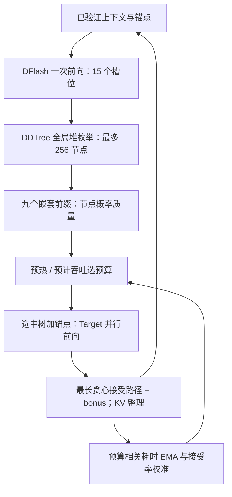

# AdaptiveTree 方法说明（T=0，非 RL）

当前 canonical `adaptive` 复用旧提交 `9dd67698ad828b8c3fca8659e3a388f0b2dfbdf7`
的 DDTree best-first 构树机制，但不等同于当时的 B≤128 控制器。当前主方法最多
枚举 256 个节点，使用九个候选预算，将 tree-build 成本归入所选预算，并关闭周期
探索。旧控制器仅以 `adaptive_legacy` 历史对照保留。两者都不是分层 RL，也不是
三路径 GBV。

## 如何构树

1. Target 预填充并生成一个已确认的锚点；DFlash 一次前向给出未来 15 个槽位的 logits。
2. 每个槽位取 top 候选，用累计 log-prob 表示前缀分数。全局最大堆每弹出一个节点，就加入它的下一个兄弟和下一层最高概率子节点；一次枚举到最多 256 个节点，不跨 block、不调用 rank head。
3. 枚举结果的前 30/45/60/80/100/128/160/192/256 个节点分别是一棵合法的嵌套树。对每棵树计算节点前缀概率之和，作为草稿代理下的接受收益。
4. 首先从初始预算 60 开始，再按与 60 的距离（同距取较小值）为九个预算各取得一次观测。之后用“1＋校准后的预计接受数”除以“固定草稿耗时＋对应预算的构树、编译、验证与提交耗时”选预算。统计量用 EMA（0.2）更新；canonical 主方法不做每 64 轮一次的周期探索。
5. 仅将选中预算的节点与锚点交给 Target，一次 ancestor-only 树前向验证；提交最长贪心匹配前缀与一个 bonus token。整理接受路径 KV 后进入下一轮。

预算是本轮 Target 验证的候选节点数，不是最终输出数。例如保留 60 个节点，Target 同时计算 61 个当前位置（含锚点），但最多提交 15 个匹配 draft token 加 1 个 bonus，EOS 或剩余长度还可能进一步截断。

## 改进点与边界

相对固定预算 DDTree，改动是“复用一次枚举的嵌套树，以当前概率质量和运行时成本选择规模”。DDTree 的概率排序、DFlash 的块草稿、树形 attention 和 greedy 验证本身不是本方法新提出的。这里没有策略网络、训练集、奖励函数或策略梯度；EMA 是在线测量校准，不是离线 RL 训练。是否构成文献层面的新颖贡献仍需单独查新。

当前正式注册表共 8 个 Adaptive 方法：`adaptive` 主方法、`adaptive_legacy`
历史对照，以及 `adaptive_b128`、`adaptive_legacy_cost_attribution`、
`adaptive_with_exploration`、`adaptive_no_acceptance_calibration`、
`adaptive_no_latency`、`adaptive_frozen_after_warmup` 六个消融/控制。旧
`adaptive_legacy` 才是 B≤128、旧成本归因、每 64 轮探索一次的实现，不能再以
`adaptive` 名称报告。

代码映射：`ddtree_builder.py` 保留原版 best-first 构树器；`paper/controller.py` 注册当前主方法、历史对照和六个消融/控制；`paper/adaptive_official.py` 将构树和反馈接入固定版官方 DDTree 循环；`paper/official_worker.py` 执行官方基线与 Adaptive；`paper/official_reporting.py` 复用官方 TPOT 统计。正式评测已改为官方抽样，不再用原来的七数据集全量受控流程。完整协议见 [实验说明](PAPER_T0_EXPERIMENTS.md)。[T=0 证明](ADAPTIVE_DDTREE_T0_PROOF.md)中的具体控制器公式记录的是 legacy B≤128 版本；其中预算无关的树验证定理不等于对当前成本归因或吞吐收益的证明。

旧截图的 5.468/5.644/6.801/5.516× 属于历史 legacy 非 RL 架构，不是当前 canonical 的结果；原始 2,000 条记录仅 727 条与 AR token 完全一致。不能据此宣称已证明实际实现无损，也不能将其当作新的官方协议实验结果。新协议必须保留原始不一致诊断并按声明的审计策略限制结论。
